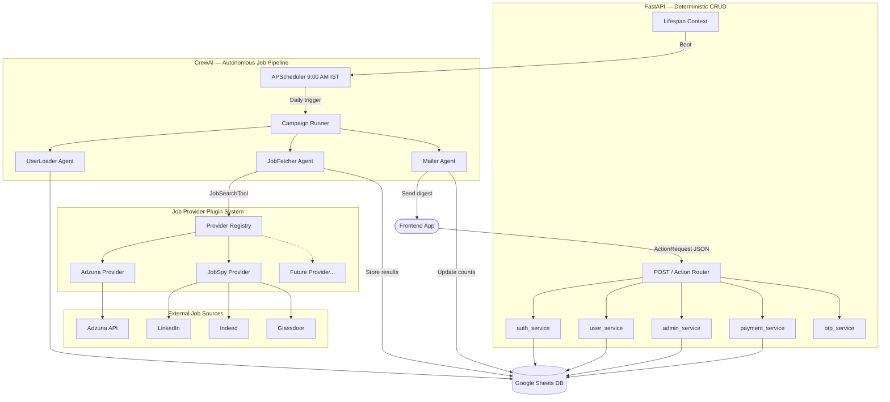
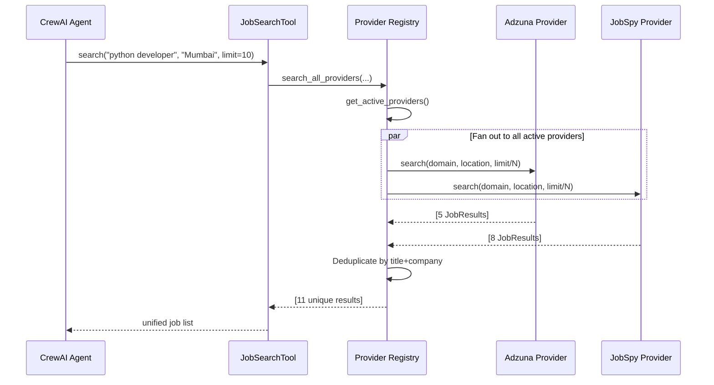
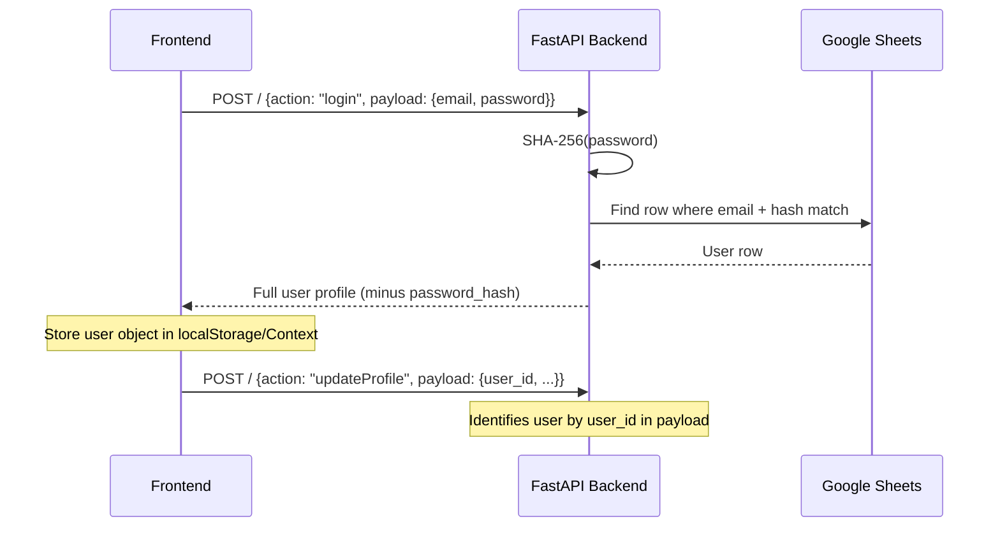

# Job Automation Backend Architecture

> **⚠️ INTERNAL ONLY — Do not push to GitHub or any public repository.**

---

## 1. Design Philosophy

| Layer | Responsibility | Technology |
|---|---|---|
| **FastAPI** | Deterministic CRUD (auth, profiles, admin, payments) | Plain Python service functions |
| **CrewAI** | Nondeterministic job pipeline (search, filter, email) | Agents + Tasks |
| **Google Sheets** | Persistent storage | gspread singleton |

---

## 2. System Architecture



---

## 3. Job Provider Plugin System

This is the core extensibility mechanism. Every job source is a **provider** that implements a simple interface.

### How it works



### Adding a new provider

**3 steps, zero changes to existing code:**

```
tools/job_providers/
├── base.py                 ← JobProvider ABC (don't touch)
├── __init__.py             ← Registry (add 1 import + 1 line)
├── adzuna_provider.py      ← Existing
├── jobspy_provider.py      ← Existing
└── your_new_provider.py    ← Step 1: Create this
```

**Step 1** — Create `your_new_provider.py`:
```python
from tools.job_providers.base import JobProvider, JobResult

class MyNewProvider(JobProvider):
    def get_name(self) -> str:
        return "MySource"

    def is_available(self) -> bool:
        return True  # check API keys, imports, etc.

    def search(self, domain, location, limit=10, max_days_old=7) -> list[JobResult]:
        # Hit your API, return normalised JobResult objects
        ...
```

**Step 2** — Register in `__init__.py`:
```python
from tools.job_providers.your_new_provider import MyNewProvider

_ALL_PROVIDERS = [
    AdzunaProvider(),
    JobSpyProvider(),
    MyNewProvider(),    # ← just add this line
]
```

**Step 3** — Done. The `JobSearchTool` automatically fans out to your new provider.

### Current providers

| Provider | Sources | Requires | Graceful Fallback |
|---|---|---|---|
| **Adzuna** | Adzuna aggregator | `ADZUNA_APP_ID`, `ADZUNA_API_KEY` in `.env` | Skipped if keys missing |
| **JobSpy** | LinkedIn, Indeed, Glassdoor, Google Jobs | `pip install python-jobspy` | Skipped if not installed |

---

## 4. Data Schema (Google Sheets)

| Sheet | Purpose | Key Columns |
|---|---|---|
| `Users` | User profiles + preferences | user_id, email, domains, locations, status, emails_sent |
| `Payments` | Payment state machine | payment_id, status (pending/approved/rejected) |
| `Password_OTP` | One-time password tokens | email, otp, expiry, used |
| `Audit_Log` | Admin action history | timestamp, action, admin_email, target_user |
| `System_Settings` | Runtime toggles | key, value (e.g. system_enabled) |
| `Fetched_Jobs` | Job history + dedup state | user_id, job_id, title, source, matched_domain |

---

## 5. Authentication Model

**Stateless / Client-Side Identity** — no JWTs, no cookies on the backend.



- **User auth**: SHA-256 hash comparison against the Users sheet
- **Admin auth**: Credentials checked against `ADMIN_EMAIL` / `ADMIN_PASSWORD` env vars
- **Blocked users**: Rejected at login time

---

## 6. Security Boundaries

| Concern | Protection |
|---|---|
| Secrets | `.env` + `credentials.json` excluded via `.gitignore` |
| SQL Injection | N/A — no SQL database |
| Password Storage | SHA-256 hex digest (never returned in responses) |
| Rate Limiting | 2s sleep between users, 1s between API calls |
| Payment Fraud | Duplicate txn_id check, 3-submission/24h limit per user |

---

## 7. Testing Strategy

Two standalone test scripts, no pytest dependency required.

| Script | What it tests | Requires |
|---|---|---|
| `test_search.py` | Job provider layer in isolation | Internet only |
| `test_api.py` | Full FastAPI action router against live Sheets | Running server + Sheets |

### test_search.py (8 Tests)

| Test | Validates |
|---|---|
| Provider Discovery | Which providers are active on this machine |
| Single Domain + Location | python developer in Mumbai returns results |
| Multiple Domains | Simulates user with 3 job titles |
| Multiple Locations | Simulates user with 3 cities |
| Required Fields Present | title, company, url, source on every result |
| Multi-Source Coverage | Results come from more than 1 platform |
| Redirect URL Validity | All URLs start with http or https |
| Email Template Rendering | HTML contains all expected elements |

### test_api.py (7 Suites)

| Suite | Validates |
|---|---|
| Health Endpoint | GET /health returns stats |
| Invalid Action | Unknown actions return 400 |
| Authentication Flow | Register, Login, Duplicate rejection, Wrong password |
| Profile Updates | Domains, locations, remote, experience, salary round-trip |
| Status Toggle | Pause, Active, Unsubscribe, Reactivate |
| Admin Flow | Admin login, get users, settings, stats, audit logs |
| Unsubscribe HTML | GET /unsubscribe returns styled HTML page |

### Running Tests

```bash
# Test job search providers (no server needed)
python test_search.py

# Start server, then test API
uvicorn main:app --reload
python test_api.py
```

---

## 8. Bugs Found and Fixed

### Critical (Would crash at runtime)

| File | Bug | Fix |
|---|---|---|
| user_service.py | gspread.utils imported at bottom, used at top | Moved import to top |
| user_service.py | batch_update called with wrong dict format | Replaced with update_cell loop |
| auth_service.py | Empty sheet crashes on all_rows index 0 | sheets_client auto-bootstraps headers |
| payment_service.py | _find_payment returns 3 or 4 values inconsistently | Both paths now return 4 values |

### Functional (Wrong results)

| File | Bug | Fix |
|---|---|---|
| jobspy_provider.py | Missing Naukri coverage | Added google to SITES (indexes Naukri) |
| email_template.py | No source badge per job | Added platform badge per job card |
| email_template.py | Generic Apply Now button | Shows Apply on LinkedIn etc |
| user_service.py | Variable shadows config import | Renamed to sys_settings |

### Polish

| Area | Fix |
|---|---|
| sheets_client.py | SHEET_HEADERS dict with auto-insert for all 6 sheets |
| Testing | Created test_search.py for provider isolation testing |
| Testing | Created test_api.py with 7 suites covering all 21 actions |

---

## 9. Edge Cases Handled

### Authentication
- Empty sheet on first run: headers auto-bootstrap via sheets_client
- Duplicate email: case-insensitive check before insert
- Duplicate username: case-insensitive, skipped if not provided
- Blocked user login: clear 400 error, not 500
- Password never leaked: password_hash stripped from every response
- User cap 85: registration rejected at row 86

### Profile and Preferences
- Partial updates: only fields present in payload are modified
- Non-existent user_id: returns 400 not 500
- Username uniqueness: checked against all rows except own row

### Job Search Pipeline
- No providers available: returns empty list with logged warning
- Provider import fails: gracefully skipped via is_available check
- Missing API keys: provider excluded from fan-out silently
- API timeout or error: each provider catches own exceptions
- Cross-provider dedup: title + company normalized to lowercase
- Zero jobs found: no_jobs counter incremented, no empty email sent

### Payments
- Transaction ID length: validated 6-50 chars
- Amount range: validated 50-10000
- Duplicate transaction ID: full scan of Payments sheet
- Rate limit: max 3 submissions per user per 24h window
- Double-approve prevention: status must be pending
- Blocked user: rejected before payment insert

### Email
- No salary data: shows Salary Undisclosed instead of zero
- Salary formatting: above 100000 displayed as 15.0L, below as 50,000
- Source mapping: raw linkedin displayed as LinkedIn
- SMTP failure on admin notify: swallowed, submission still succeeds

### Google Sheets First-Run
- All 6 sheets auto-create with correct headers if missing
- System_Settings seeds system_enabled as TRUE on first access
- No manual sheet setup needed beyond sharing with service account email
